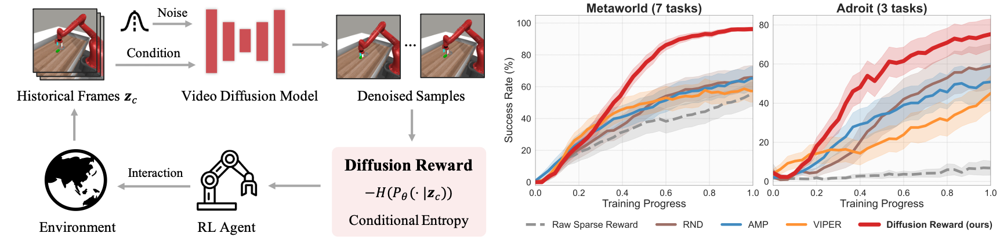

# Diffusion Reward
[[Project page]](https://diffusion-reward.github.io/)
[[Paper]]()
[[Data]](https://huggingface.co/datasets/tauhuang/diffusion_reward/tree/main)
[[Models]](https://huggingface.co/tauhuang/diffusion_reward/tree/main)

This is the official PyTorch implementation of the paper "[**Diffusion Reward: Learning Rewards via Conditional Video Diffusion**]()" by 

[Tao Huang](https://taohuang13.github.io/)<sup>\*</sup>, [Guangqi Jiang]()<sup>\*</sup>, [Yanjie Ze](https://yanjieze.com/), [Huazhe Xu](http://hxu.rocks/).
<p align="left">
  
</p>

# 🛠️ Installation Instructions
Clone this repository.
```bash
git clone https://github.com/TaoHuang13/diffusion_reward.git
cd diffusion_reward
```
Create a virtual environment.
```bash
conda env create -f conda_env.yml 
conda activate diffusion_reward
pip install -e .
```
Install extra dependencies.
- Install PyTorch.
```bash
pip3 install torch==1.12.1+cu116 torchvision==0.13.1+cu116 --extra-index-url https://download.pytorch.org/whl/cu116
```
- Install mujoco210 and mujoco-py following instructions [here](https://github.com/openai/mujoco-py#install-mujoco).

- Install Adroit dependencies.
```bash
cd env_dependencies
pip install -e mj_envs/.
pip install -e mjrl/.
cd ..
```
- Install MetaWorld following instructions [here](https://github.com/Farama-Foundation/Metaworld?tab=readme-ov-file#installation).

# 💻 Reproducing Experimental Results
## Download Video Demonstrations 
|Domain        | Tasks | Episodes| Size | Collection | Link  |       
|:------------- |:-------------:|:-----:|:----:|:-----:|:-----:|
| Adroit | 3 | 150 | 23.8M | [VRL3](https://github.com/microsoft/VRL3) | [Download](https://huggingface.co/datasets/tauhuang/diffusion_reward/tree/main/adroit) 
| MetaWorld | 7 | 140 | 38.8M | [Scripts](https://github.com/Farama-Foundation/Metaworld/blob/master/scripts/demo_sawyer.py) | [Download](https://huggingface.co/datasets/tauhuang/diffusion_reward/tree/main/metaworld)|

You can download the datasets and place them to  `/video_dataset` to reproduce the experimental results in the paper. 

## Pretrain Reward Models
Train VQGAN encoder. 
```bash
bash scripts/run/codec_model/vqgan_${domain}.sh    # [adroit, metaworld]
```
Train video models.
```bash
bash scripts/run/video_model/${video_model}_${domain}.sh    # [vqdiffusion, videogpt]_[adroit, metaworld]
```

### (Optinal) Download Pre-trained Models
We also provide the pre-trained reward models (including Diffusion Reward and VIPER) used in this paper for result reproduction. You may download the models with configuration files [here](https://huggingface.co/tauhuang/diffusion_reward/tree/main), and place the downloaded folders in `/exp_local`.

## Train RL with Pre-trained Rewards 
Train DrQv2 with different rewards.
```bash
bash scripts/run/rl/drqv2_${domain}_${reward}.sh    # [adroit, metaworld]_[diffusion_reward, viper, viper_std, amp, rnd, raw_sparse_reward]
```

# 🧭 Code Navigation

```
diffusion_reward
  |- configs               # experiment configs 
  |    |- models           # configs of codec models and video models
  |    |- rl               # configs of rl 
  |
  |- envs                  # envrionments, wrappers, env maker
  |    |- adroit.py        # Adroit env
  |    |- metaworld.py     # MetaWorld env
  |    |- wrapper.py       # env wrapper and utils
  |
  |- models                # implements core codec models and video models
  |    |- codec_models.py  # image encoder, e.g., VQGAN
  |    |- video_models.py  # video prediction models, e.g., VQDiffusion and VideoGPT
  |    |- reward_models.py # reward models, e.g., Diffusion Reward and VIPER
  |
  |- rl                    # implements core rl algorithms
```

# ✉️ Contact
For any questions, please feel free to email taou.cs13@gmail.com.


# 🏷️ License
This repository is released under the MIT license. See [LICENSE](LICENSE) for additional details.

# 📝 Citation

If you find our work useful, please consider citing:
```
@article{Huang2023DiffusionReward,
  title={Diffusion Reward: Learning Rewards via Conditional Video Diffusion},
  author={Tao Huang and Guangqi Jiang and Yanjie Ze and Huazhe Xu},
  journal={arxiv}, 
  year={2023},
}
```